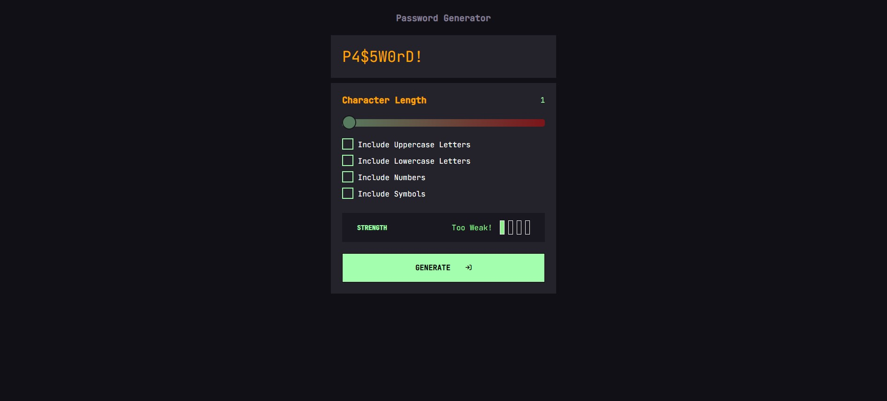
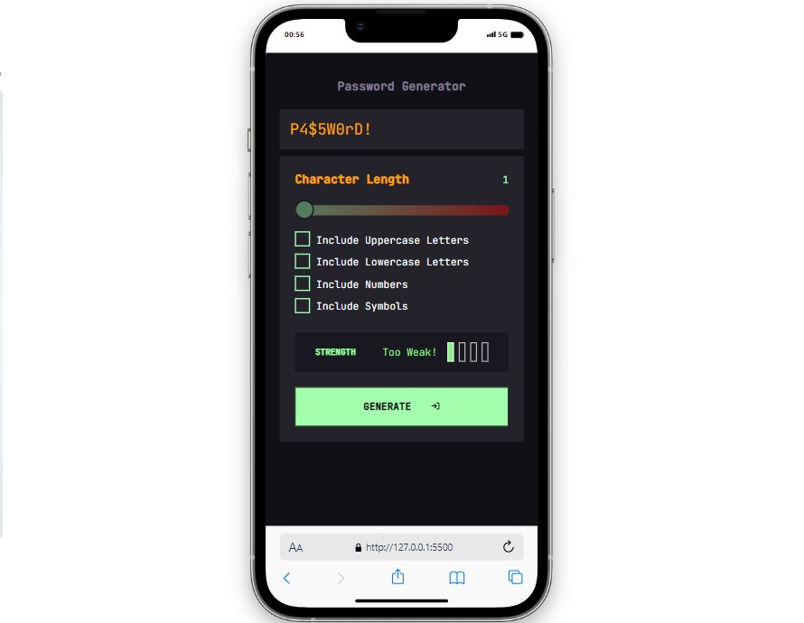

# Password Generator

This is a simple web application where users can generate secure passwords with various customization options.
## Screenshots



## Live Link

[Password Generator](https://password-genarator-2.vercel.app/)

## Features

- **Random Password Generation**: Users can generate random passwords by clicking a button.
- **Customizable Options**: Users can specify the password length and choose to include uppercase letters, lowercase letters, numbers, and symbols.
- **Copy to Clipboard**: Generated passwords can be easily copied to the clipboard.
- **User-Friendly Interface**: The interface is designed to be intuitive and easy to use.

## Technologies Used

- HTML
- CSS
- JavaScript
- Font Awesome Icons
- Notyf (for notifications)

## Usage

1. Open the web page in your browser.
2. Specify your desired settings for password generation, including the character length and options for including uppercase letters, lowercase letters, numbers, and symbols.
3. Click the "Generate" button to create a password.
4. Click the "Reset" button to clear the password display.
5. Click the "Copy" button to copy the generated password to your clipboard.

## Responsive Design



## File Structure

- `index.html`: HTML file containing the structure of the web page.
- `style.css`: CSS file defining the style of HTML elements.
- `app.js`: JavaScript file for password generation and user interactions.
- `notyf.min.js` and `notyf.min.css`: Notyf library files for notifications.
- `favicon.ico` and `lock.png`: Favicon images for the web page.

## Installation

1. Clone the repository to your local machine:

   ```bash
   git clone https://github.com/your-username/password-generator.git

